# GUI
Display related files  
Modular LVGL configs for different screen sizes  
Images might be out of date

128x128 (Click to expand)

| Boot screen  | Analog clock | Temperature  | NordPool | Weather  | Status |
| ------------- | ------------- | ------------- | ------------- | ------------- | ------------- |
|   | 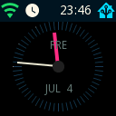  | 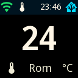  | 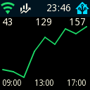  | 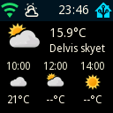  | 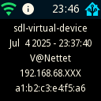  |

200x200

| Boot screen  | Analog clock | Temperature  | NordPool | Weather  | Status |
| ------------- | ------------- | ------------- | ------------- | ------------- | ------------- |
|   | 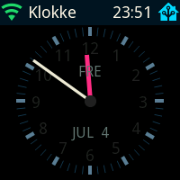  | 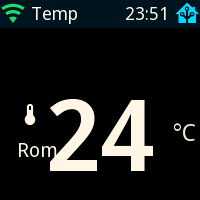  | 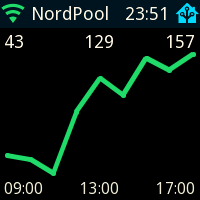  | 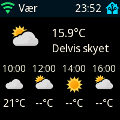  | 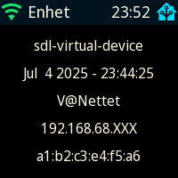  |

240x135

| Boot screen  | Analog clock | Temperature  | NordPool | Weather  | Status |
| ------------- | ------------- | ------------- | ------------- | ------------- | ------------- |
|   | 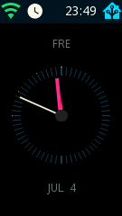  | 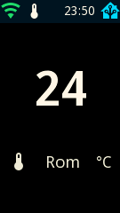  | 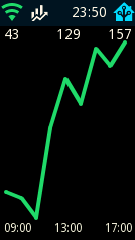  | 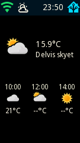  | 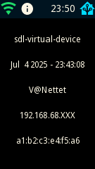  |

240x240

| Boot screen  | Analog clock | Temperature  | NordPool | Weather  | Status |
| ------------- | ------------- | ------------- | ------------- | ------------- | ------------- |
|   | 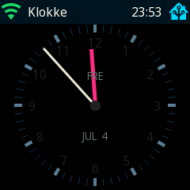  | 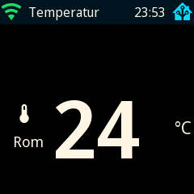  | 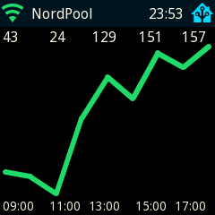  | 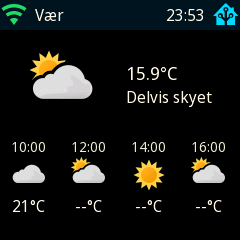  | 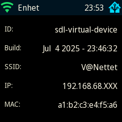  |

240x320

| Boot screen  | Analog clock | Temperature  | NordPool | Weather  | Status |
| ------------- | ------------- | ------------- | ------------- | ------------- | ------------- |
| 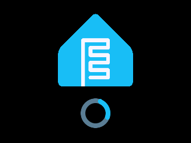  | 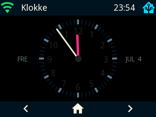  | 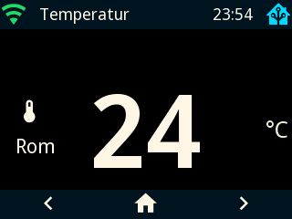  | 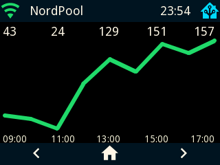  | 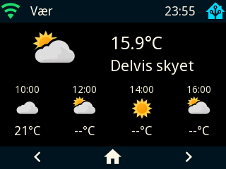  | 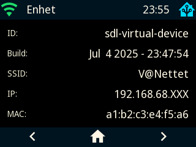  |

480x320

| Boot screen  | Analog clock | Temperature  | NordPool | Weather  | Status |
| ------------- | ------------- | ------------- | ------------- | ------------- | ------------- |
| 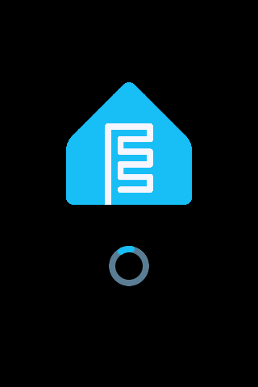  | 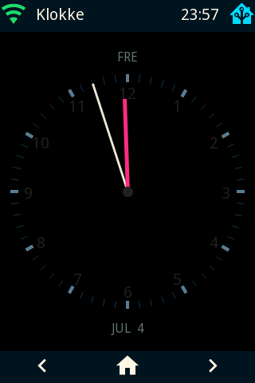  | 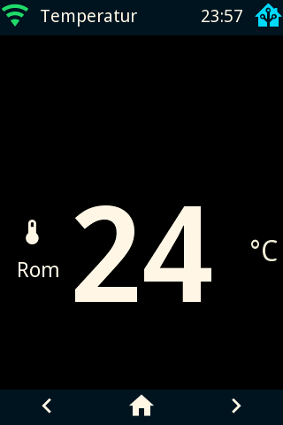  | 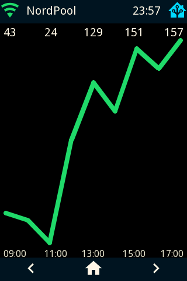  | 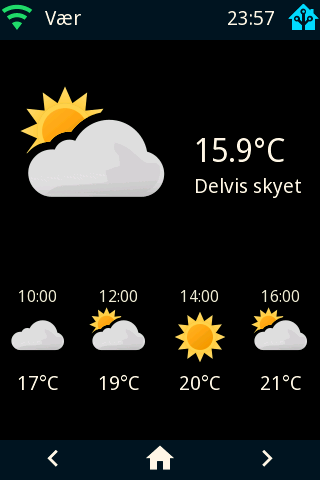  | 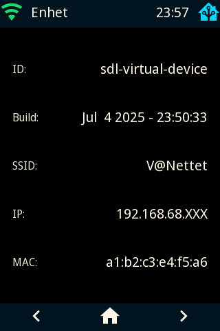  |

480x800

| Boot screen  | Analog clock | Temperature  | NordPool | Weather  | Status |
| ------------- | ------------- | ------------- | ------------- | ------------- | ------------- |
| 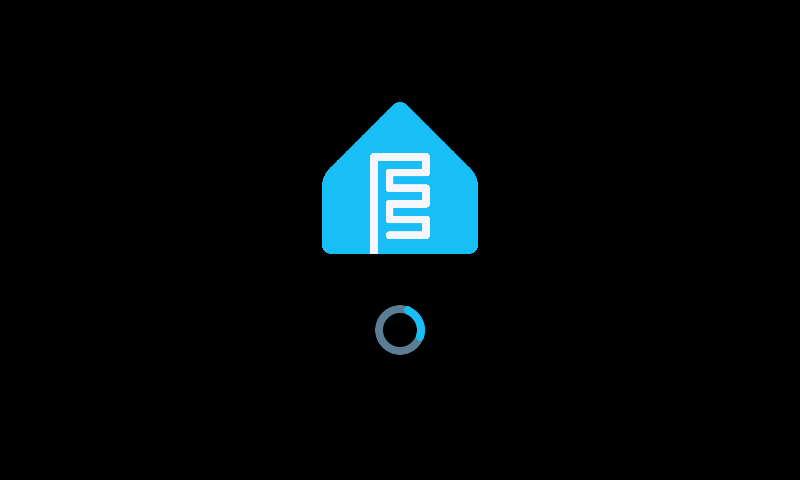  | 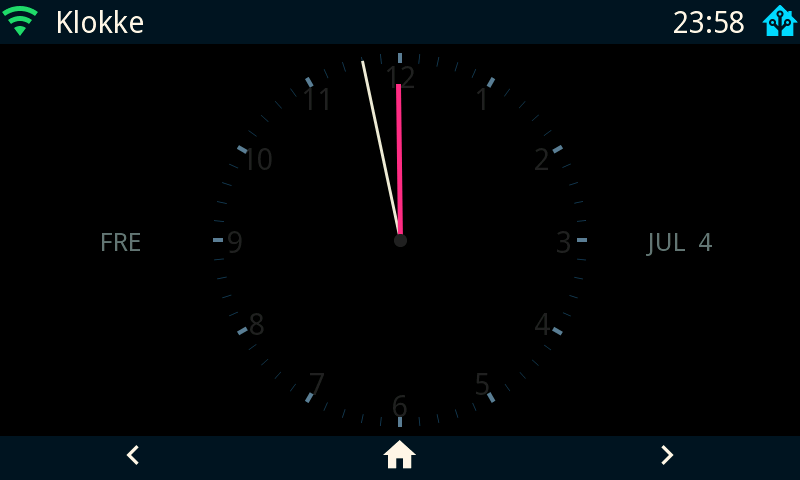  | 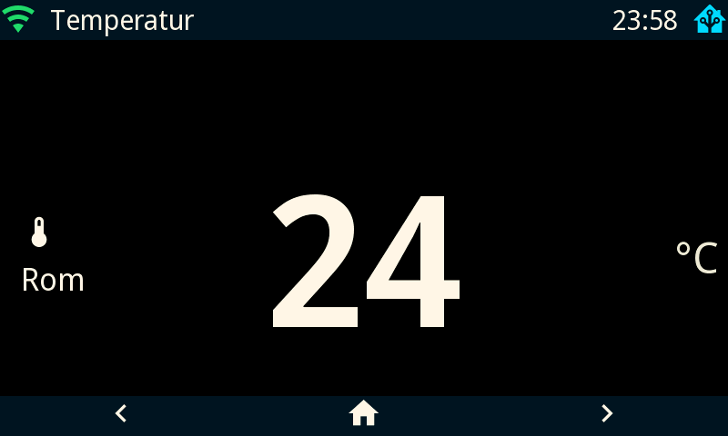  | 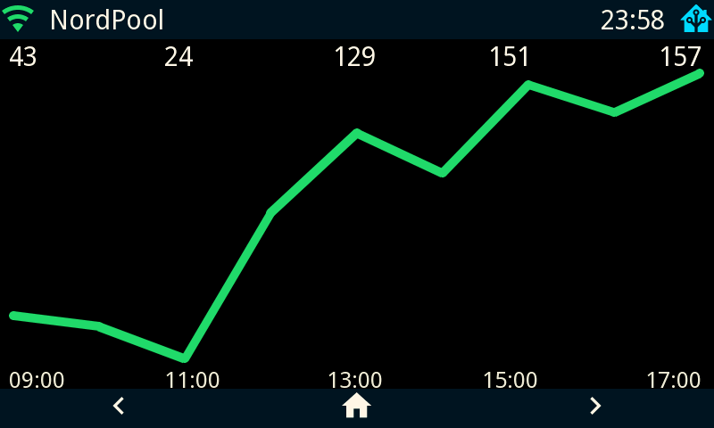  | 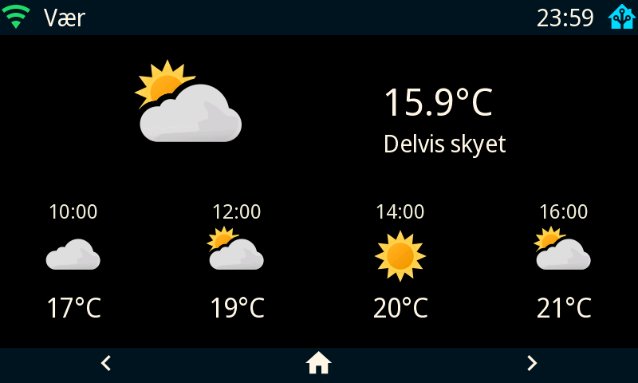  | 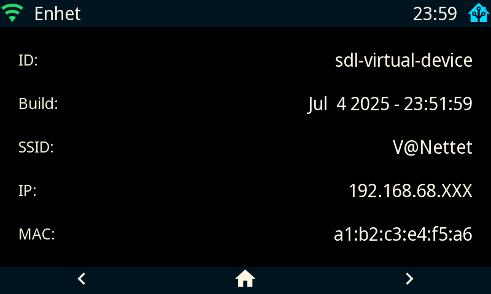  |

